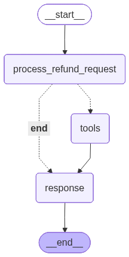

# [LangChain智能体本质论-10]LangChain和LangGraph两种编程模式的同一性

LangGraph赋予我们根据推理任务自由构建流程图的能力，所以我们完全可以不使用工具，而将每个工具的功能实现在某个节点中，这样对于流程的每个步骤都具有精准的控制。但是任何事都有利弊，这样的编程模式让我们摒弃了`ToolNode`具有的很多能力，在利用LangGraph开发Agent过程中有效地使用`ToolNode`，有时可以起到事半功倍的作用。

## 1. `create_agent`工厂函数如何构建状态图

基于LangGraph的编程模式将推理任务转换成由节点和边的状态图。我们利用`StateGraph`作为Builder来构建这个状态图，在添加所有功能节点后，通过在节点之间添加边实现节点之间基于状态的路由。对于常规调用（区别于中断恢复调用），入口节点率先执行，节点执行后会改变状态，边决定的路由规则根据当前状态选择下一步执行的节点。整个执行就以这样的方式向前推进，直到没有后续节点需要执行或者达到设定的步数限制。

对于LangChain编程模式（这里指利用`create_agent`工厂函数创建的Agent），它依然会利用`StateGraph`来构建上述的状态图，而且绑定的默认状态类型为`AgentState`，它具有一个核心的字段`messages`用来存储整个执行过程中产生的各种消息（`HumanMessage`、`AIMessage`和`ToolMessage`）。它关联的`reducer`函数确保针对该字段的更新永远是往此消息列表中追加新的消息。

在没有中间件注册的情况下，状态图的节点只有两个，一个是用于封装指定模型组件的`model`节点，另一个则是用于封装所有注册工具的`tools`节点，其类型就是`ToolNode`，注册的工具同样会被绑定到`model`节点封装的模型组件上。`tools`节点到`model`节点之间由一条静态边，而`model`节点到`tools`和`__end__`节点有一条条件边，所以整个图结构总是如下所示的样子。我们调用Agent时可以在状态成员`messages`添加一条（`HumanMessage`）或者多条消息（为LLM的推理模拟一段对话），作为入口的`model`节点率先被执行，它会将整个消息历史、系统提示词和注册的工具集作为调用LLM的输入。

![Alternative Text][1774157182093]

## 2. 双节点状态图推进流程

LLM会根据提示词体现的推理任务，以及可用的工具集，确定是否需要对其中的一个或者多个工具发起调用。如果需要，它会为每个待调用的工具生成一个`ToolCall`对象，该对象承载着工具名称、工具调用ID以及从输入提取出来的参数列表。这个`ToolCall`列表作为`AIMessage`的核心内容返回给`model`节点，后者将其添加到状态成员`messages`保存的对话历史中。

`model`到`tools`和`__end__`节点的条件边体现了这样的路由规则：

- 如果消息历史中的最后一条`AIMessage`携带`ToolCall`对象，则路由到`tools`节点;
- 否则任务`AIMessage`携带的就是最终的回答，流程立即终止。

`tools`节点执行的时候会从消息历史中的最后一条`AIMessage`中提取所有的`ToolCall`对象，如果自己封装的工具包含其中，则以并发的方式执行它们。如果工具返回一个`Command`对象，其`updates`字段返回的内容会被用来增量更新状态（其中必需包含一个`ToolMessage`保证整个消息历史结构完整性），`goto`字段用于实现跳转。返回的非`Command`内容会被用来创建一条`ToolMessage`，并被添加到消息历史中。如果在没有利用`Command`的`goto`字段完成跳转的情况下，`tools`到`model`之间的边会再次路由到`model`节点上。整个Agent的执行就按照这样的方式不断循环。

## 3. 两种编程模式的同一性

对于任何一个利用LangChain(`create_agent`)编程模式创建的Agent，都可以采用基于LangGraph的编程模式来编写。比如下面这个简单的用于提供天气信息的Agent。

```python
from langchain_openai import ChatOpenAI
from langchain_core.tools import tool
from langchain_core.messages import HumanMessage
from langchain.agents import create_agent
from dotenv import load_dotenv
load_dotenv()

@tool
def get_weather(city: str) -> str:
    """A tool to get weather information for a given city."""
    return f"It's sunny today in {city}."

agent = create_agent(
    model = ChatOpenAI(model="gpt-5.2-chat"),
    tools=[get_weather]
)

message = HumanMessage(content="What is the weather like in Suzhou?")
for message in agent.invoke({"messages": [message]})["messages"]:
    message.pretty_print()
```

如果采用基于LangGraph的编程模式来重写，就是如下这个样子：

```python
from langchain_openai import ChatOpenAI
from langchain_core.tools import tool
from langchain_core.messages import HumanMessage
from langgraph.graph import StateGraph
from langgraph.prebuilt import ToolNode, tools_condition
from langchain.agents import AgentState
from dotenv import load_dotenv
load_dotenv()

@tool
def get_weather(city: str) -> str:
    """A tool to get weather information for a given city."""
    return f"It's sunny today in {city}."

llm = ChatOpenAI(model="gpt-5.2-chat").bind_tools(tools=[get_weather])

def model(state: AgentState):
    response = llm.invoke(state["messages"])
    return {"messages": [response]}

agent = (StateGraph(AgentState)
         .add_node("model", model)
         .add_node("tools", ToolNode(tools=[get_weather]))
         .set_entry_point("model")
         .set_finish_point("model")
         .add_edge("tools", "model")
         .add_conditional_edges("model",path=tools_condition)
         .compile()
)   
message = HumanMessage(content="What is the weather like in Suzhou?")
for message in agent.invoke({"messages": [message]})["messages"]:
    message.pretty_print()
```

## 2. ToolNode

为了能够在LangGraph中更有效的利用`ToolNode`，我们对它的定义做一个详细的介绍。`ToolNode`继承了`RunnableCallable`，其`name`字段表示节点名称，上面我们将它称为`tools`节点就是因为它的默认值为`tools`。

### 2.1 ToolNode的构建

根据如下所示的针对`__init__`的定义，可用看出创建`ToolNode`时除了需要提供注册的工具序列之外，还可以初始化其他一些字段成员用于对工具的执行做相应的控制。

```python
class ToolNode(RunnableCallable):
    name: str = "tools"
    def __init__(
        self,
        tools: Sequence[BaseTool | Callable],
        *,
        name: str = "tools",
        tags: list[str] | None = None,
        handle_tool_errors: bool
        | str
        | Callable[..., str]
        | type[Exception]
        | tuple[type[Exception], ...] = _default_handle_tool_errors,
        messages_key: str = "messages",
        wrap_tool_call: ToolCallWrapper | None = None,
        awrap_tool_call: AsyncToolCallWrapper | None = None,
    ) -> None:
        super().__init__(self._func, self._afunc, name=name, tags=tags, trace=False)
        self._tools_by_name: dict[str, BaseTool] = {}
        self._injected_args: dict[str, _InjectedArgs] = {}
        self._handle_tool_errors = handle_tool_errors
        self._messages_key = messages_key
        self._wrap_tool_call = wrap_tool_call
        self._awrap_tool_call = awrap_tool_call
        for tool in tools:
            if not isinstance(tool, BaseTool):
                tool_ = create_tool(cast("type[BaseTool]", tool))
            else:
                tool_ = tool
            self._tools_by_name[tool_.name] = tool_
            self._injected_args[tool_.name] = _get_all_injected_args(tool_)
```

`ToolNode`的`__init__`具有如下参数：

- **tools**：注册的工具，如果执行的是一个`Callable`对象，将会转换成一个`BaseTool`对象，通常是一个`StucturedTool`对象。关于`BaseTool`以及`Callable`向`BaseTool`的转换规则在“[赋予Agent执行力的工具是个什么东西？(https://blog.csdn.net/JaydenAI/article/details/159199546)”一文中具有详细介绍。所有表示工具的`BaseTool`对象会保存在`_tools_by_name`字段对应的字典中，Key为工具的名称；
- **name**：当前节点的名称，默认为`tools`；
- **handle_tool_errors**：用于指定异常处理的策略或者异常处理器；
- **messages_key**：由于`ToolNode`的执行都是围绕着代表对话历史的消息列表进行的，所以它能工作的前提是具有如此一个表示消息历史的状态成员。该参数表示此状态成员的名称，默认值为`messages`；
- **wrap_tool_call/awrap_tool_call**：包装工具调用（同步和异步）的包装器，利用它可以实现针对工具调用的AOP。

`__init__`方法除了将指定的参数赋值给对应的字段外，还完成了**注入参数的提取**，具体体现在针对`_get_all_injected_args`方法的调用上。该方法返回一个`_InjectedArgs`对象，用来表示工具函数中是否具有针对状态、表示长期存储的`BaseStore`和表示工具运行时的`ToolRuntime`的参数注入。因为`ToolCall`提供的参数列表只会包含它们，但是在调用工具函数时却必须指定。我的文章“[如何在工具函数中注入各种运行时对象？](https://blog.csdn.net/JaydenAI/article/details/159238698)”具有对这个问题的详细介绍。

```python
def _get_all_injected_args(tool: BaseTool) -> _InjectedArgs:
@dataclass
class _InjectedArgs:
    state: dict[str, str | None]
    store: str | None
    runtime: str | None
```

#### 2.1.1 工具调用的包装

我们知道表示中间件的`AgentMiddleware`定义了`wrap_tool_call`和`awrap_tool_call`方法用来工具调用的包装，你会发现着两个方法的签名和`ToolNode`的`wrap_tool_call`/`awrap_tool_call`参数的声明的可执行对象具有一致的签名。当`create_agent`方法在创建`ToolNode`的时候，会提取所有注册的中间，并创建两个`Callable`对象来表示体现针对它们的`wrap_tool_call`和`awrap_tool_call`方法的按序调用，这两个`Callable`对象会作为调用`__init__`方法的`wrap_tool_call`/`awrap_tool_call`参数。

```python
ToolCallWrapper = Callable[
    [ToolCallRequest, Callable[[ToolCallRequest], ToolMessage | Command]],
    ToolMessage | Command,
]

AsyncToolCallWrapper = Callable[
    [ToolCallRequest, Callable[[ToolCallRequest], Awaitable[ToolMessage | Command]]],
    Awaitable[ToolMessage | Command],
]

class AgentMiddleware(Generic[StateT, ContextT]):
    def wrap_tool_call(
        self,
        request: ToolCallRequest,
        handler: Callable[[ToolCallRequest], ToolMessage | Command[Any]],
    ) -> ToolMessage | Command[Any]

    async def awrap_tool_call(
        self,
        request: ToolCallRequest,
        handler: Callable[[ToolCallRequest], Awaitable[ToolMessage | Command[Any]]],
    ) -> ToolMessage | Command[Any]
```

如果`ToolNode`在LangGraph中使用，意味着我们得手工创建它。如果具有针对工具调用进行包装的需求，可以显式提供这两个参数。在如下的演示程序中，我们根据定义的工具`get_weather`创建了一个`ToolNode`，针对同步调用的包装器被设置成`log`函数，我们利用它输出工具调用的输入和输出。

```python
from typing import Callable, Any
from langchain_core.tools import tool
from langgraph.types import Command
from langchain_core.messages import AIMessage,ToolCall,ToolMessage
from langgraph.prebuilt import ToolNode
from langchain.agents.middleware import ToolCallRequest
from langchain_core.runnables import RunnableConfig
from langgraph.runtime import Runtime
from langgraph._internal._constants import CONFIG_KEY_RUNTIME

@tool
def get_weather(city: str) -> str:
    """A tool to get weather information for a given city."""
    return f"It's sunny today in {city}."

def log(
        request: ToolCallRequest,
        handler: Callable[[ToolCallRequest], ToolMessage | Command[Any]],
    ) -> ToolMessage | Command[Any]:
    
    print(f"Tool call '{request.tool_call['name']}' started with args: {request.tool_call['args']}")
    result = handler(request)
    print(f"Tool call '{request.tool_call['name']}' finished with result: {result}")
    return result

tool_node = ToolNode(tools=[get_weather], wrap_tool_call=log)

tool_call = ToolCall(name="get_weather", args={"city": "Suzhou"}, id="tool_call_001")
messages = [AIMessage(content="", tool_calls=[tool_call])]
config ={
    "configurable": {
        CONFIG_KEY_RUNTIME: Runtime(),
    }
}

tool_message:ToolMessage = tool_node.invoke(messages, config=config)[0]
assert tool_message.name == "get_weather"
assert tool_message.content == "It's sunny today in Suzhou."
assert tool_message.tool_call_id == "tool_call_001"
```

我们提供一个`AIMessage`列表作为调用`ToolNode`的输入，此`AIMessage`中携带一个用于描述工具调用`ToolCall`对象。作为参数的`RunnableConfig`中添加了一个必需的`Runtime`对象。调用`ToolNode`返回一个包含一个`ToolMessage`对象的列表，此`ToolMessage`正是对`get_weather`工具函数返回值的封装。包装器`log`输出如下所示：

```
Tool call 'get_weather' started with args: {'city': 'Suzhou'}
Tool call 'get_weather' finished with result: content="It's sunny today in Suzhou." name='get_weather' tool_call_id='tool_call_001'
```

#### 2.1.2 异常处理

`__init__`方法的`handle_tool_errors`参数决定了当工具执行抛出异常时，`ToolNode`如何捕获并将其转化为发送回LLM的消息，而不是让整个程序直接崩溃。它具有如下几种定义方法：
- **布尔值**：
    - True: 捕获所有异常，并将错误堆栈信息作为字符串返回作为`ToolMessage`的内容返回给LLM；
    - False (默认): 不捕获异常。如果工具报错，程序直接抛出异常并停止运行。
- **字符串**：
    - 自定义提示: 无论发生什么错误，都返回这段固定的字符串给LLM；
    - 用途: 隐藏具体报错细节（出于安全考虑），给模型一个通用的重试建议。
- **异常类型**：定向捕获，仅捕获指定的异常，如果抛出的是指定异常，则将其转化为消息返回；如果抛出的是其他异常，程序依然会崩溃；
- **自定义函数 (Callable[..., str])**：异常处理函数；

该参数默认指定如下一个异常处理函数，意味着在默认情况下只处理`ToolInvocationError`。

```python
def _default_handle_tool_errors(e: Exception) -> str:
    if isinstance(e, ToolInvocationError):
        return e.message
    raise e
```

如下的程序演示了几种异常异常处理方式，包括将参数`handle_tool_errors`指定为True、错误消息和异常处理函数。

```python
from typing import Callable
from langchain_core.tools import tool
from langgraph.types import Command
from langchain_core.messages import AIMessage,ToolCall
from langgraph.prebuilt import ToolNode
from langchain_core.runnables import RunnableConfig
from langgraph.runtime import Runtime
from langgraph._internal._constants import CONFIG_KEY_RUNTIME

@tool
def fake_tool():
    """A tool that should not be called."""
    raise ValueError("This tool should not be called.")

tool_call = ToolCall(name="fake_tool", args={},  id="tool_call_001")
messages = [AIMessage(content="", tool_calls=[tool_call])]
config ={
    "configurable": {
        CONFIG_KEY_RUNTIME: Runtime(),
    }
}

def invoke(handle_tool_errors: bool
        | str
        | Callable[..., str]
        | type[Exception]
        | tuple[type[Exception], ...]) -> str:
    tool_node = ToolNode(tools=[fake_tool], handle_tool_errors=handle_tool_errors)
    print(tool_node.invoke(messages, config=config)[0].content)

print("=== handle_tool_errors=True ===")
invoke(handle_tool_errors=True) 

print("\n=== handle_tool_errors=custom message ===")
invoke(handle_tool_errors="Error happened while calling tool.")  

print("\n=== handle_tool_errors=handler function ===")
invoke(handle_tool_errors=lambda exc: f"Error happened while calling tool: {str(exc)}")  
```

输出：

```=== handle_tool_errors=True ===
Error: ValueError('This tool should not be called.')
 Please fix your mistakes.

=== handle_tool_errors=custom message ===
Error happened while calling tool.

=== handle_tool_errors=handler function ===
Error happened while calling tool: This tool should not be called.
```

### 2.2 ToolNode的执行

从上面的实例可以看出，当我们传入携带`ToolCall`的`AIMessage`列表作为参数时，执行`ToolNode`会返回一个`ToolMessage`的列表。其实返回类型不仅于输入参数的类型有关，还与工具函数的返回类型有关。

#### 2.2.1 ToolNode的输出类型

作为一个`Runnable`对象，`ToolNode`接收如下四种输入类型：

- 消息列表；
- ToolCall列表；
- 字典且可以通过`messages_key`得到消息列表；
- 一个Pydantic模型且具有一个名为`messages_key`的数据成员返回消息列表；

而工具函数的则具有如下两种返回类型：

- 返回`Command`，利用其`update`字段实现状态更新，并利用`goto`字段实现跳转；
- 返回其他内容用于生成`ToolMessage`;

确定`ToolNode`的输出类型的规则主要有如下几条：

- 规则一：如果没有任何一个工具函数返回`Command`，只有在输入消息列表的情况下返回`ToolMessage`，针对其他三种输入均返回一个字典。如下的代码体现了这一规则：

```python
from typing import Annotated
from langchain_core.tools import tool
from langchain_core.messages import AIMessage, ToolCall, AnyMessage
from langgraph.prebuilt import ToolNode
from langgraph.runtime import Runtime
from langchain_core.runnables import RunnableConfig
from langgraph._internal._constants import CONFIG_KEY_RUNTIME
from pydantic import BaseModel
import operator

class State(BaseModel):
    messages: Annotated[list[AnyMessage], operator.add]

@tool
def foo(x: int, y: int) -> str:
    """A test tool foo."""
    return f"foo({x}, {y})"

@tool
def bar(x: int, y: int) -> str:
    """A test tool bar."""
    return f"bar({x}, {y})"

tool_node = ToolNode(tools=[foo, bar])

tool_calls = [
    ToolCall(name="foo", args={"x": 1, "y": 2}, id="001", type="tool_call"),
    ToolCall(name="bar", args={"x": 3, "y": 4}, id="002", type="tool_call"),
]
messages = [AIMessage(content="", tool_calls=tool_calls)]
config: RunnableConfig = {
    "configurable": {
        CONFIG_KEY_RUNTIME: Runtime(),
    }
}

result = tool_node.invoke(messages, config=config)
print(f"input-messages: {result}")

result = tool_node.invoke(tool_calls, config=config)
print(f"input-tool_calls: {result}")

result = tool_node.invoke({"messages": messages}, config=config)
print(f"input-dict: {result}")

result = tool_node.invoke(State(messages=messages), config=config) # type: ignore
print(f"input-state: {result}")
```

输出：

```
input-messages: [ToolMessage(content='foo(1, 2)', name='foo', tool_call_id='001'), ToolMessage(content='bar(3, 4)', name='bar', tool_call_id='002')]
input-tool_calls: {'messages': [ToolMessage(content='foo(1, 2)', name='foo', tool_call_id='001'), ToolMessage(content='bar(3, 4)', name='bar', tool_call_id='002')]}
input-dict: {'messages': [ToolMessage(content='foo(1, 2)', name='foo', tool_call_id='001'), ToolMessage(content='bar(3, 4)', name='bar', tool_call_id='002')]}
input-state: {'messages': [ToolMessage(content='foo(1, 2)', name='foo', tool_call_id='001'), ToolMessage(content='bar(3, 4)', name='bar', tool_call_id='002')]}
```

返回的字典已经显式地利用Key指明了消息实例所在的状态成员，所以生成的`ToolMessage`会添加到此状态成员中。如果返回的是一个`ToolMessage`列表，如果当前状态就是一个消息列表，那么每个`ToolMessage`都会被添加到此列表中。否则会根据构造时设置的`messages_key`定位消息历史成员，如果`Command`的`update`字段被设置成消息列表，也是一样处理。

- 规则二：如果存在某一个或者多个工具函数返回一个`Command`
    - `update`字段被设置为一个`ToolMessage`列表，此时作为输入的只能时消息列表；
    - `update`字典被设置成一个字典，此时要求输入类型为其余三种；

在这种情况下，`ToolNode`最终返回一个列表。
- 如果`Command`将`graph`字段设置为`Command.PARENT`，并将`goto`设置成一个`Send`对象的列表实现针对父`Agent`某个节点的跳转，这些`Command`将会被合并成一个，这些`Command`的`goto`字段中的`Send`对象将会合并成一个列表（不去重），并作为这个合并`Command`对象的`goto`字段。`Command`的`update`字典会被丢弃，意味着不能有针对父`Agent`状态的更新。合并后的`Command`会被添加到列表中；
- 其他的`Command`直接添加到列表中；
- 返回类型不是`Command`的工具函数，会按照规则一生成`ToolMessage`列表或者字典，并添加到列表中；

在如下的演示程序中，我们让工具函数返回一个常规的`Command`对象，其`update`字段被设置为字典，最终返回的列表中将包含此`Command`对象。

```python
from typing import Annotated
from langchain_core.tools import tool
from langgraph.types import Command
from langchain_core.messages import AIMessage, ToolCall, ToolMessage, AnyMessage
from langgraph.prebuilt import ToolNode
from langchain_core.runnables import RunnableConfig
from langgraph.runtime import Runtime
from langgraph._internal._constants import CONFIG_KEY_RUNTIME
from pydantic import BaseModel
import operator

class State(BaseModel):
    messages: Annotated[list[AnyMessage], operator.add]

@tool
def foo(x: int, y: int) -> Command:
    """A test tool foo."""
    update = {"messages": [ToolMessage(content=f"foo({x}, {y})", tool_call_id="001")]}
    return Command(update=update, goto="next")

@tool
def bar(x: int, y: int) -> str:
    """A test tool bar."""
    return f"bar({x}, {y})"

tool_node = ToolNode(tools=[foo, bar])

tool_calls = [
    ToolCall(name="foo", args={"x": 1, "y": 2}, id="001", type="tool_call"),
    ToolCall(name="bar", args={"x": 3, "y": 4}, id="002", type="tool_call"),
]
messages = [AIMessage(content="", tool_calls=tool_calls)]
config: RunnableConfig = {
    "configurable": {
        CONFIG_KEY_RUNTIME: Runtime(),
    }
}

result = tool_node.invoke(tool_calls, config=config)
print(f"input-tool_calls: {result}")

result = tool_node.invoke({"messages": messages}, config=config)
print(f"input-dict: {result}")

result = tool_node.invoke(State(messages=messages), config=config) # type: ignore
print(f"input-state: {result}")
```

输出：

```
input-tool_calls: [Command(update={'messages': [ToolMessage(content='foo(1, 2)', name='foo', tool_call_id='001')]}, goto='next'), {'messages': [ToolMessage(content='bar(3, 4)', name='bar', tool_call_id='002')]}]
input-dict: [Command(update={'messages': [ToolMessage(content='foo(1, 2)', name='foo', tool_call_id='001')]}, goto='next'), {'messages': [ToolMessage(content='bar(3, 4)', name='bar', tool_call_id='002')]}]
input-state: [Command(update={'messages': [ToolMessage(content='foo(1, 2)', name='foo', tool_call_id='001')]}, goto='next'), {'messages': [ToolMessage(content='bar(3, 4)', name='bar', tool_call_id='002')]}]
```

然后我们让`foo`和`bar`这两个工具函数返回一个`graph`被设置成`Command.PARENT`的`Command`，并将它们的`goto`字段设置成包含两个`Send`对象的列表，最终我们会发现`ToolNode`的输出只有一个`Command`对象，它的`goto`字段包含四个`Send`对象（进行不去重合并）。

```python
from typing import Annotated
from langchain_core.tools import tool
from langgraph.types import Command, Send
from langchain_core.messages import AIMessage, ToolCall, ToolMessage, AnyMessage
from langgraph.prebuilt import ToolNode
from langchain_core.runnables import RunnableConfig
from langgraph.runtime import Runtime
from langgraph._internal._constants import CONFIG_KEY_RUNTIME
from pydantic import BaseModel
import operator

class State(BaseModel):
    messages: Annotated[list[AnyMessage], operator.add]

@tool
def foo(x: int, y: int) -> Command:
    """A test tool foo."""
    update = {"messages": [ToolMessage(content=f"foo({x}, {y})", tool_call_id="001")]}
    goto = [Send(node="A", arg=None), Send(node="B", arg=None)]
    return Command(update=update, goto=goto, graph= Command.PARENT)

@tool
def bar(x: int, y: int) -> Command:
    """A test tool bar."""
    update = {"messages": [ToolMessage(content=f"foo({x}, {y})", tool_call_id="001")]}
    goto = [Send(node="B", arg=None), Send(node="C", arg=None)]
    return Command(update=update, goto=goto, graph= Command.PARENT)

tool_node = ToolNode(tools=[foo, bar])

tool_calls = [
    ToolCall(name="foo", args={"x": 1, "y": 2}, id="001", type="tool_call"),
    ToolCall(name="bar", args={"x": 3, "y": 4}, id="002", type="tool_call"),
]
messages = [AIMessage(content="", tool_calls=tool_calls)]
config: RunnableConfig = {
    "configurable": {
        CONFIG_KEY_RUNTIME: Runtime(),
    }
}

result = tool_node.invoke(tool_calls, config=config)
print(f"input-tool_calls: {result}")

result = tool_node.invoke({"messages": messages}, config=config)
print(f"input-dict: {result}")

result = tool_node.invoke(State(messages=messages), config=config) # type: ignore
print(f"input-state: {result}")
```

输出：

```
input-tool_calls: [Command(graph='__parent__', goto=[Send(node='A', arg=None), Send(node='B', arg=None), Send(node='B', arg=None), Send(node='C', arg=None)])]
input-dict: [Command(graph='__parent__', goto=[Send(node='A', arg=None), Send(node='B', arg=None), Send(node='B', arg=None), Send(node='C', arg=None)])]
input-state: [Command(graph='__parent__', goto=[Send(node='A', arg=None), Send(node='B', arg=None), Send(node='B', arg=None), Send(node='C', arg=None)])]
```

#### 2.2.2 工具的并行调用

从`__init__`方法中针对基类（`RunnableCallable`）同名方法的调用不难看出，`ToolNode`的执行逻辑体现在它的`_func`和`_afunc`方法上。

```python
class ToolNode(RunnableCallable):
    name: str = "tools"
    def __init__(
        self,
        tools: Sequence[BaseTool | Callable],
        *,
        name: str = "tools",
        tags: list[str] | None = None,
        handle_tool_errors: bool
        | str
        | Callable[..., str]
        | type[Exception]
        | tuple[type[Exception], ...] = _default_handle_tool_errors,
        messages_key: str = "messages",
        wrap_tool_call: ToolCallWrapper | None = None,
        awrap_tool_call: AsyncToolCallWrapper | None = None,
    ) -> None:
        super().__init__(self._func, self._afunc, name=name, tags=tags, trace=False)
```

同步指定`ToolNode`的`_func`方法定义如下（`_afunc`方法实现与之类似）, 它首先会调用`_parse_input`从三种类型的输入中提取最后一条`AIMessage`消息中携带的所有`ToolCall`对象，以及当前输入的类型（类型为`Literal["list", "dict", "tool_calls"]`），就是上面介绍的消息列表、`ToolCall`列表和字典（含`Pydantic`模型）。

```python
class ToolNode(RunnableCallable):

    def _func(
        self,
        input: list[AnyMessage] | dict[str, Any] | BaseModel,
        config: RunnableConfig,
        runtime: Runtime,
    ) -> Any:
        tool_calls, input_type = self._parse_input(input)
        config_list = get_config_list(config, len(tool_calls))

        tool_runtimes = []
        for call, cfg in zip(tool_calls, config_list, strict=False):
            state = self._extract_state(input)
            tool_runtime = ToolRuntime(
                state=state,
                tool_call_id=call["id"],
                config=cfg,
                context=runtime.context,
                store=runtime.store,
                stream_writer=runtime.stream_writer,
            )
            tool_runtimes.append(tool_runtime)

        input_types = [input_type] * len(tool_calls)
        with get_executor_for_config(config) as executor:
            outputs = list(
                executor.map(self._run_one, tool_calls, input_types, tool_runtimes)
            )

        return self._combine_tool_outputs(outputs, input_type)
```

然后为每个`Tool_Call`创建`RunnableConfig`配置和作为工具运行时的`ToolRuntime`,然后从配置中提取预先设置的`ThreadPoolExecutor`对象，池线程池的方式并发调用每个工具。针对每个工具的调用实现在`_run_one`方法中，它的执行逻辑很简单：利用`Tool_Call`携带的工具名称找到对应的`BaseTool`对象，调用其`invoke`方法完成对应工具函数的执行。如果工具函数返回的`Command`将直接作为`_run_one`方法的返回值，返回的其他对象将用于创建返回的`ToolMessage`对象。最后调用`_combine_tool_outputs`方法按照上述的规则合并这些返回的`Command`和`ToolMessage`，并返回列表或者字典。

### 2.3 针对`ToolNode`的路由

根据状态针对tools节点的路由体现在如下这个`tools_condition`函数上（模块路径为`langgraph.prebuilt`）。它首先的路由规则很简单：

- 如果最后一条`AIMessage`携带`Tool_Call`，意味着需要执行相应的工具，此时返回`tools`并希望路由到`ToolNode`节点;
- 否则任务`AIMessage`的内容就是最终的回答，直接返回“__end__”。

在添加指向`ToolNode`和其他节点的条件边时，我们一般将`tools_condition`作为路由路径映射函数。如果我们的`ToolNode`具有自定义的名字，或者在不需要调用工具时还需要路由到另一个节点，我们可以为`add_conditional_edge`方法的第三个参数提供一个字段将`tools`和`__end__`映射为具体的节点名称。

```python
def tools_condition(
    state: list[AnyMessage] | dict[str, Any] | BaseModel,
    messages_key: str = "messages",
) -> Literal["tools", "__end__"]:
    if isinstance(state, list):
        ai_message = state[-1]
    elif (isinstance(state, dict) and (messages := state.get(messages_key, []))) or (
        messages := getattr(state, messages_key, [])
    ):
        ai_message = messages[-1]
    else:
        msg = f"No messages found in input state to tool_edge: {state}"
        raise ValueError(msg)
    if hasattr(ai_message, "tool_calls") and len(ai_message.tool_calls) > 0:
        return "tools"
    return "__end__"
```

虽然在大部分场景下我们会利用LLM的能力确定待执行的工具，并由它生成包含对应`ToolCall`的`AIMessage`。不过有的时候，如果某个节点已经根据当前状态确定了下一步执行的工具和传入参数，我们也可以将工具调用封装成`ToolCall`列表，并置于创建的`AIMessage`中，最后只需将其添加到消息列表中就可以了。

如下这个程序演示了处理订单退款请求，具体流程如下图所示：用户提供退款请求，`process_refund_request`节点分析提交的文本，并确定是否是一个包含订单ID和退款金额的有效退款请求。对于有效请求，会路由到`tools`节点利用两个工具进行处理：如果金额小于1000，直接调用`refund`工具退款；否则调用`audit`工具作进一步审核。最终交给`response`节点作统一回复。



这个例子仅仅利用了LLM分析语义能力将自然语言请求转换成结构化的输出Refund（是否有效退款请求、订单ID和金额）。虽然不再需要AI参与其余流程，但是为了实现针对`tools`节点的路由和辅助工具的执行，`process_refund_request`依然会创建一个`AIMessage`，并在其中存放待调用的工具`refund`或者`audit`。

```python
import operator,io
from typing import Annotated, TypedDict
from langchain_openai import ChatOpenAI
from langchain_core.tools import tool,InjectedToolCallId
from langchain_core.messages import BaseMessage, HumanMessage, ToolMessage,AIMessage,ToolCall
from langgraph.graph import StateGraph
from langgraph.prebuilt import ToolNode,InjectedState,tools_condition
from langgraph.types import Command
from PIL import Image as PILImage
from dotenv import load_dotenv
import uuid

load_dotenv()
class Refund(TypedDict):
    is_valid: bool
    """Whether the refund request is valid, which must contain an order ID and amount."""
    order_id: str|None
    """Order ID for the refund."""    
    amount: int|None
    """Refund amount."""

class RefundState(TypedDict):
    messages: Annotated[list[BaseMessage], operator.add]
    details: Refund
    done: bool
    audit:str
    error:str

@tool
def refund(state: Annotated[dict, InjectedState],tool_call_id:Annotated[str, InjectedToolCallId]) -> Command:   
    """Process a refund based on the provided details in the state."""
    order_id =  state.get("details", {}).get("order_id")
    amount = state.get("details", {}).get("amount")    

    content = f"Refund of {amount} dollars has been processed for order {order_id}."  
    return Command(update={"done": True,"messages":[ToolMessage(content=content, tool_call_id=tool_call_id)]})

@tool
def audit(state: Annotated[dict, InjectedState],tool_call_id:Annotated[str, InjectedToolCallId]) -> Command:
    """Audit a refund request based on the provided details in the state."""
    order_id =  state.get("details", {}).get("order_id")
    amount = state.get("details", {}).get("amount")

    content = f"Large refund ({amount} dollars) detected for order {order_id}, flagging for review."
    return Command(update={"audit": content,"messages":[ToolMessage(content=content, tool_call_id=tool_call_id)]})

llm = ChatOpenAI(model="gpt-5.2-chat").bind_tools(tools=[refund, audit])

def process_refund_request(state: RefundState) -> dict:
    prompt ="""
Please extract refund details from the user's message. The details should include:
    - Whether the refund request is valid (must contain an order ID and amount).
    - The order ID for the refund.
    - The refund amount.
"""    
    llm_with_output = llm.with_structured_output(schema= Refund) # type: ignore
    messages = [*state["messages"], HumanMessage(content=prompt)]
    refund = llm_with_output.invoke(input = messages) # type: ignore
    
    if(not refund["is_valid"]):
        error = "Invalid refund details. Missing order ID or amount."
        return {"error": error,"messages":[AIMessage(content=error)]}
    
    tool_call = (ToolCall(name="audit", args={}, id=str(uuid.uuid4())) if refund["amount"] > 1000 
                 else ToolCall(name="refund", args={}, id=str(uuid.uuid4())))    
    return {
        "details": refund, 
        "messages": [AIMessage(content="", tool_calls=[tool_call])],
    }

def response(state: RefundState):
    error = state.get("error")
    if error:
        return {"messages": [AIMessage(content=error)]}
    audit = state.get("audit")
    if audit:
        return {"messages": [AIMessage(content=audit)]}
    if state.get("done"):
        return {"messages": [AIMessage(content="Refund processed successfully.")]}  
```    

Agent创建出来后，我们提交两个具有不同退款金额（1500和100）的请求，

```python
request = HumanMessage(content="I want to refund an order with ID 12345 for the amount of 1500 dollars.")
result = agent.invoke({"messages": [request]}) # type: ignore
for message in result["messages"]: 
    message.pretty_print()

request = HumanMessage(content="I want to refund an order with ID 12345 for the amount of 100 dollars.")
result = agent.invoke({"messages": [request]}) # type: ignore
for message in result["messages"]: 
    message.pretty_print()
```

按照处理流程，第一个请求不会正常处理，需要进一步审核，第二个请求会直接处理，输出结果体现了这一点：

```
================================ Human Message =================================

I want to refund an order with ID 12345 for the amount of 1500 dollars.
================================== Ai Message ==================================
Tool Calls:
  audit (429704ce-877f-4707-9b26-bac8cfd4197c)
 Call ID: 429704ce-877f-4707-9b26-bac8cfd4197c
  Args:
================================= Tool Message =================================
Name: audit

Large refund (1500 dollars) detected for order 12345, flagging for review.
================================== Ai Message ==================================

Large refund (1500 dollars) detected for order 12345, flagging for review.
```

```
================================ Human Message =================================

I want to refund an order with ID 12345 for the amount of 100 dollars.
================================== Ai Message ==================================
Tool Calls:
  refund (fe4ce10a-4d74-47dd-b9ba-ed8c1e223c6b)
 Call ID: fe4ce10a-4d74-47dd-b9ba-ed8c1e223c6b
  Args:
================================= Tool Message =================================
Name: refund

Refund of 100 dollars has been processed for order 12345.
================================== Ai Message ==================================

Refund processed successfully.
```

[1774157182093]:data:image/png;base64,iVBORw0KGgoAAAANSUhEUgAAAKIAAAC7CAIAAABpSdIfAAAAAXNSR0IArs4c6QAAAARnQU1BAACxjwv8YQUAAAAJcEhZcwAADsMAAA7DAcdvqGQAACTOSURBVHhe7Z15fBRV2u+fc6q6eu+kk5AFQhLClkAgYXdBEZVRXHEb33Gc1RlHr86dufN5R7zvR+91xve9OqNeZ1HRO+rouAwyjoAOgiARCci+BBJCIAuBLJ3O1mt1d1Wdc+4flTRJJZCEdLrTob+f/kD3eU5XdepX55znLPUcxBiDBOMdrE1IMB5JyHxZkJD5siAh82UBGjcuWNBPulqV2gqf6FYoYYpCAQABQhgoAYQBGDBgCBAgYJQhjBgDhAAAGAWEgVFACAD1fGQMGEIYGGUAfd8wBhQhDhAApQAAiANgwCgAA05AOh0yJ+umlVisyZzBzGl/a9QZDzK3NYYqdnub6wLWFI4QJggc5kGRVZkBc0AU4DhEKQAwgG4hMYcoBYSYehEQQqr2AMAoQxxilAEDxCFGGABgDlHCAABhxBgDCogDhBAlDBggHgFjjAIA8DoMAIrCEEYup5xXaJyxwJo+Wa/93VEkvmUOBeihL931J/yTpukn5ZumFpvxGGuFao76m2oCTbXijPnWudcmC3qkzREV4ljmgI9seafVksQXL0tKz4llWRkU57nQ4e1dksSW3T0hKY3XmkefeJXZ7yGla50Zkw2Lb7ZDbErI8KCEHStzOxpCV96akpSm05pHmTFWxw0N0aNs+6A1M8+weGV8aKw27SXXJWflG7Z94PR2KVrzKBOXMu9c356cplv0LbvWMOYpviYpt8B4rMylNYwy8Sdz46lAwEevvWeC1hAnFC62NZ4KNFT5tYbRJP5kLi9zTZ9vGWse9dCx2PlpJZYjO9xq9yw6xNnVOlctejuVmfMtWsPIcDqdn3zyCVVHOi6KKIp/+9vftKnDpHCJjRLwuqLXQseZzC1nQla7wOlG6ne1tbWVlZUdOnQoGAwyxj777LO1a9d++eWXlFJCyIkTJ8rKyk6dOqVmdjgcTU1Nx44dq6qqKi0tXbduXWlpqSiK2oMOGZOV0xtRxW6P1jBqcM8884w2bazCGFQf9OYVmidkj6iXfPz48VdffbW1tXX//v0HDhyYO3fuli1bqqurJ06cOGvWrDVr1pSWlra0tOzYsUOW5YKCgnXr1r3++usVFRUWi6W2traysjIzM7OgoMBoNGoPPWSa64PuNmnmAqvWMDrEU2kO+Eh7k2S0jfQ3b9y4EWP81FNPPffcc4sWLdLr9XfccUdBQcEjjzxiMBhKSkp+/OMfP/bYY4sXL/70008BQK/Xi6K4evXqe++99+qrry4sLHz00UdTUlK0xx0O6ZMM3ePpUWGklyyaSEEaCpKRX5wFCxY4HI5nn322rKxs+fLlFovF7XbLsiyKIsdxPM+vXbv2hRde2LlzZ1dXF2OMMTZjxoy8vDwACAaDsiwHAgHtQYdJcqqOi+K1j+KpRgxCSJ1aGCErV6588sknzWbzO++888QTT7S3t+v1egAwGo01NTV/+tOfli5d+vzzzz/yyCMmk0n1y3Q6HSEEANRBQzTie01WgEVxZCeeZDaYOYuNp0SbPiwopeXl5enp6b/61a9effXVtra2Q4cOcRxHKUUINTU18Ty/cuVKhFBFRUVnZyfHcQj1GRKmlHLcSOcWOx0hShMdqoHQG9GEbKGrVdYahgPGeN++fatXr16/fv3GjRtTUlKmTJmSnp7e0dHx9ttvp6SkcBz3xhtvbNiwobW1lTG2d+9en88X9qvz8vK6urrWrFnT1dWlPfRwcJ4LapNGk3jytAHA2Rg6dchbuCRpJMMjM2fOVBSlpqYGY/zggw/OmDHDZrMlJSV1dnZed911s2fPrqqqwhg/8MADqampXV1dhYWFubm5+fn5CCG73W61Wj0ez5w5c0biaVft9+TPMqfnGLSG0SHOZqi6nPLW9xwrf5RlS9FO5wUCAb/fjy+qP2OM5/mkpCStYfh4PB5Zlns30pq6XT2dwWAwm829EwGguS6w4x9tdz8+KWoLS7S/bOyzfa1TJ+Br707TpG/dunXDhg29r6miKAih3u2ooiiTJ09+/PHHBUEIJ14CDQ0N77zzjsvl4vnzdxvP84SQ8PVkjBFCli5des8995z/JgCl8NU6JyXsxgcyRuzJDZX4k7mjRd76fsuN38nQDJKEQqFgMBguXgghWZYxxhzH9f4bMcZms3mErjIhRBRFzaUjhPR3zQRBMBj61MzOxlDph223/CTDlhK9Wef4kxkAjuxw1VeKt/wo02C6WBU9BgmKdPNfHVOKzCXLItBwDJ24lBkAjnzlCvnZgm8l64QRlctoEgrQ7X9vM1m5a+9JxZEYABg6cVYawsxbnmywoi/fd46wfxU1RC/Z9FaLLY2/7r60KGscx6VZ5XCp6+R+T8Ei6+yrk/SGMXrLhgL0+C732WoxM9dwxS0pmIu2xnEvMwDUV/iP73a7O+T8IktuoVEwcoIecxxQ1r0oG9AF3oSvdvgC9KQgQCycGv7KgPS2qsdkgBBQCrJEQyKpKfe31Adsdn7JyrS0SSNy70dC3MusUn3Q62gItjdJnQ6J12FOB7JMu9fe932cAgAQRhD+q8OJKKwlEnQ6QgihFKB7hT2gnuczGKDwbXD+gAAIGOk+F69DgBBVmNWuS88Wsqeb8udqu85RZpzIrBLwkU6HJEuM0RH9WZs2bcrPzy8sLNQaLkK4qgBACDCHdHqcPEFnsmq7WDFhXMkcKV557eUlS5YsWnCV1hC3jFG3JbYQGQON3thFFEjIPACEkN6jmOOAhMwDMOCwZVyTkHkAFEVJyDz+SZTmy4KILAMaUyRkHoBEab4sSMh8WaAoysUXG8Ud4+qPiSAJmcc/GOOEzOMcQgjGeISLxcYaCZm1EEIQQgmZxzmq/5WQeZxDKU3IPP5RF/EnZB7nUErNZnPC0x7nYIyDweBQws3EEQmZtfA8L8tyQuZxDsZ4/K2PS8isRY1cMM6UTsished5NayM1hDPJGTWkijNlwsJmS8XEjKPfzDGahSwcUNC5gFQo4hoU+OZhMwDwHFcQubxj16vH2GoobFGQubzEEKqq6tPnjzZ2dl54sSJqqqq+vr68eGLJR58PY/P57vjjjuam5uNRiMhRFGUH/zgB7/+9a/HwWxV3P8BEcRkMt18880cx6nD2pMmTVq1atU40Dghcx8wxvfdd19OTo4kSZTSFStWzJgxQ5spPknI3IcpU6bcdc/tQcmXOTHt1ttvGjdrSMZL28zAeS509pSoSLRPOJieNyoIIQYM9TKBGi2GqZHQGUK4paX5k/XrsydOuv222xGH1QGxcNjV7gP2xBDCCFiv42OEWHgAjTGdns+eZszIHdHOHBFhPMgsBenOj9s9nYpCmSLRcDAoxrq3be4TEqpXWCfGoOe/nu16Ael0HGOIMTVODVVvgvPZ0HmNu2MIMfU4oN5G0Gtyi9djRiF3pnHJSntE4vpfMnEvc9BP923uZIDnXpMsmHBPSQLoHd0nfIU1eofpGwdILbLn14/0jiPW+wj9o4b1/YgxBHz0wJbO1Axu8c3J0dzDREPct801R/2tDfKCFSkGK1a3j0A9UvV50zu9t6nfR7UaUGv1Ptb+R7jQ8Xs+MgomK776rrSGk4Gq/T7tT48icS+zpyuUXWjmdUDkbnnG1IsooNeDxc7Xn4jqppAa4l5mxsA4tpfbUgqMMVmK5RrCMXx5hgztDts4dqH0fAzQmBD/Mvd2fMcq4VY/VsS/zKi3pzuGYbH8kfEvc1zANB24aBP/Msfy6g0VBjEenYh/mWNZFw4VtTMdQ+Jf5rgAAaBYlueEzIPAGOgFMJm06aqJ48BigUF77YwBS7hgI4KBOpswSggCnDxVu2vXfkqpplPE89DR0bXlix2iGLy40urYZwy56K+LC9DgGyFjDIIAPA8GA+j1gDHodGA0gq4nNDrGoNeDwQCCcL5oqvkNJtizp+zDv79DCMG4z0F4Hhqbzr362ksej3uMBwWMf5kHAyEIBEJNTU6323fw4NGamgaEoLHRsW//kY4ON88DxoAQnK45c+Dg0YaGJnXSgufB4xEPHz7e0uwwGo1ms4UxEATwePzl5SeqTtYwBjwPHMdZLNZBx1pZjAfB4m1j3/6cOyXyAp8+WbjQ9t16PZw+XfN/nv9fTmdrReWxzzdvaG1tPXbs8N69u/Yf3FM0e57dbvr4n/9c948Pzp5t2Lbtc8zxxcXT29pcf/jj7/Yf3Ov1BCsry3meX3Hjirr6xt+/+NuKivKqkyfOnKmdPWtOR6frmz07b7xhpdVqvtCD75iDMxU+RtnMhVatLVoMchuODzDmPB5XdnbOs88+PaeoZMsXn9191/3P/uaFzs72Y8cOn6w+8+ln//zxDx95/vnf3nLLnes3fHTuXNuWrZ+7XJ3P/dfv71p1ZzAYDIaCjLG1a981myzPP/fSfzz51NGjh7du287z/JCa3SFkGVUuC5kpoyajefGiq4CB3Z4yY0bB9OkTKaPJSXYxIFZWHktLTVu4cA6RYcH8JYosVZ+qqa+vnT17bpJdn5ZumzdvIc/zrc6O2rrTM2YU1NWfOHuuzmaz7du3axgRh4aab1S4LGQG1VNjjFFgjHGYUxSglDHGEEIB0c/zOsaAEAAEOp1AiEyJwvPdHhrP8xzHK4qMEdq67fNXXl3z5z//qcvVNTV/+hDX3jAW40cs41/mQf3sHsIXWnPFM7Mmdbk6vN6QYABXV5ckyxPSMixmq8PRDABA4ezZM6FgIDkp2WpLuu3Wu15+6c8v/P7P//E/f3vXXf8my/JQ1Uv0m0fEYL1mhIAQ4vN51Y5vKBQSRb9a1YqiPxAQr1iyhMPcK6/+oXT77vfef3PG9ILZs6YuXnzV/oN7Pvn48w0bt+zevYMyZrMab77ptoqK8n3795V+te0Pf3y+trYaIaQeWXvWviAEKKZXevx72gAgK4QxVjx3vsFgEMWgPTmlsHA2IRAIBKZMyZ82PWdq/uya09VVJ6tmzCj4t/u/b7aYMjOz01LT9+//hjG67Nobcybn5eZNm1UwPSU1c+/eXWfO1M2fv+jqq64lhDDGiovn6/X6C9XKmIO64z5GIIaedtyv7Nz9WbvBYph9pUUOaU0qagfXaARRBELAoAeOB78fEAKTCRQFQiEQBNDrQV2IEgqBogDGYDAAzwGh3bNLgQCog2I6HhAGQiAYBIy7j3yR8szrYPvfHUSidz46UWuLFjGtSqICQkAI+HxAKSAEIQlEsXsthyiCJAFCIMvg84HP130rqIuyAwHw+kAUIRDo1hgAJAn8Ivh8EAiA6rWpRx6cWDbNl4HMY4HEIqHLAsaA0Vg2jgmZowFC6jNaMSMhczSI+dRFQubLgoTM0SCxFuyyQH2eKoaMB5lj6tzEB/Evc/eD5WMajsecLpY3Y9zLzPOo8ZRIFMBcz9K6MfUC4HVAFJaaGcvQFHEv84z5FjlIGipkhAFj4Hr+Db80H9WUcKLmff+c/U0Xyhb+t3cGnR5OHxH9bmX2lTGbtxgPUxcA0NroXfvnE/lT8+xZBjViSLi9ZupgMgOMGO0149sTSkQ1QveF6GnkjQa9ohBZUc5n63kDPTPcrMd57kkORzwBQIAAOA6bjBZXq0QpWbDCkpTR8/VYMB5krjxZvnv78cKJt4QCCiE9Dzv3DjzSE1amGwRqMCEAQBhYOAZNT57q6mq73Z6ent4dd4YNnO28zr0F77mXXF2uA4cO8jy9YsWkgnlZGelZdru92xZ14lvm0tJSo9E4a9aspKQkrW0E/PXdv5SUFM8rXqw1DAcx6P7FL36xc2eZzZpssyXn5uTm5OQ89NBDkydP1mYdfeJSZsZYZ2cnx3EHDx4sLi6eMGGCNsfICAQCPM/rwqv1L5XNmzc/88wzgUAAAERR1Ov1H3zwQUlJiTbf6BOXLtjp06e3bNnCGLvxxhsjrjEAVFVVdXV1aVOHz/Lly4uKitSCZDQaX3755eLiYm2mqBBnMtfX19fW1prN5htuuGH0mrqysrKWlhZt6vAxGAy33347QshgMDz22GOpqamxmqeKm0qbEOL1erdu3Tpv3rzp06drzRFFFEVBEHie1xqGT3t7+8MPP8zz/LvvvhsMBl0uF8dxOTk52nyjTHzIfO7cucOHDy9fvpznedOAD6FGlAMHDkybNi1StUVpaWl6enpRUREAtLS0bNu27e6777ZYLNp8o8lYl1mWZbfb7XA4fD7fkiVLolPpPffcc/fcc88oRVkmhHR1ddXV1c2ZM8doNGrNo8OYlllRlHXr1hUWFs6bN09rG018Pp/BYIhIpX0htm3blp2dXVhYqDWMDmNU5kAgUFlZmZ+fL4piRkbGyPs2w2LPnj2zZ8+22WxaQ+RgjImiWFFRYbVaZ82apTVHmrHoaTPGTpw40dTUlJycnJ2dHWWNAWDLli0ul0ubGlEQQmaz2WazORwOSZK05kgztkozY2z79u0mk2nOnDlWa8zG+r1er8lk4qISgUBRlLq6uurq6hUrVhgMBq05Qoyh0ux0Otva2gghRUVFMdQYACoqKkKhCzzEEWl4ns/Pz7fZbE6n0+v1as0RYqzIXFlZ+cUXXxiNxptuumlUG8VBYYxt3rzZ4/FoDaMGz/PLli3Lysravn17fX291hwJYl9p19TUAIDZbOZ5fjRGLi+BaFbaYRhj9fX1lNLU1FSr1RpZPz/GpVkUxUOHDhFCsrKyxojGiqJUVVVFrdIOgxDKz8+fNm3akSNHtm/frjWPjJjJ3NjYuG7dulAodPfdd8+cOVNrjh2SJH3xxRd+f8yC2S9btiwnJ8fhcERk+kQlBpW2x+ORZbmtrU0UxZKSkkGjLUUZSqnP57NYLLH9YR0dHR9//PH999+fnJystQ2faMusKMr69evz8/Pnz58fnZHL4aIoytGjR4uLi6PfX9fQ2dlJKVUUJTMzU2sbJjG4Ya+88soxqzEAYIyDweDp06e1hqiTkpJSXV29YcMGrWH4RLs019fXd3R0zJ8/P7ZV4qB0dnY6nc7MzMyI1JmXTFtbm8fjmTp1qtYwTKJ9rV0uV11d3aAxWWJOSkqKw+GorKyM4bbsao2dlZWlNQyfaJdmSZJkWTabzVrDmMTj8TidTrvdnpqaqrWNPl6v96233rr11ltHvowi2qXZ6XQeP35cURStYUxis9kCgcDBgwdjUv2YzeZVq1bl5uZqDcMn2jK73e76+voY1oTDpaio6Morrzxz5ozT6dTaRhm/38/zvCAIWsPwibbM06dPv/322yPy06MDQshms+n1+t27d0e5TO/fv3/z5s3a1Esi2m2zw+Goq6tbtGhRzHulw4Ix5nK5RFFECGVmZkanm+D1eiVJiohbEI2f2xuv11tbWxsvbXMYhJDdbrdYLGVlZaIoas2jQ0tLS6QmZKNdmmVZDoVCZrN5zA6PXByn04kxliRp4sTRDdkXCoWefvrpX/7ylxE5UbRlbm9vP3ny5OLFi+OoedYgSdKmTZtKSkqmTJmitUUUp9OZkpISkRnJaFfafr//9OnTsixrDfGDIAhLly612WzNzc1aW+RobW0lhERE4xiUZkVRAoGAxWKJ00o7jCzLW7dunThx4igtLv7www8ZY9/97ne1hksi2jJ3dXVVVFQsXrxYr4a8jWfcbrfX6zWbzXa7/aOPPtq1a9dzzz0XqccpvF4vQihSR4t2pR0IBKqrq6OwZDUKJCUlZWdn19XVvfHGG7/73e++/vrrXbt2aTNdErIsOxyOCFZ40ZY5IyPj/vvvj5cx7aHQ1ta2Zs0aWZYppXv27NGaL4n29vZPP/20o6NDa7hUoi2zKIpHjhyJ/kqrUWLbtm2rV68OhUKqr3T4yMH6M7XaTMMnI3PCQz/5UU5OttZwqUR7EwSE0L59+0bJbYk+zc3NHo+HMRaSRIZkv5vmZE+bNnUmkZksU0ViisQUmXW/Cb8Pp/T+2J0IVEHNja1edyDJag+FyPnvag7V6yVLjOfxRer46LlgX375ZUNDA0Koq6srKSkpGAzeeeedMQnEEVkkSaqpObXnq1NHdrYauNSMjEl5ebndAWcYQ4AAAVODD6kBjhhow9H0DWvEYdzS3ByUpKn5+epwIQOGAPUPZYMQqFG6EYDJyqdlCbOusFlTBuiDRU/mN99886WXXuI4jud5SZIIIR9++OGCBQu0+eKQ9nNs32bv9Lk2WzoEAoosyb2jR4XlCdM/pTcMGM/zCGFJktQSqsqszRe+L7o3emA1R72WJO6KlSkGs7Ytjp7MnZ2djz322LFjx/R6fTAYXLx48YsvvpiWlqbNF284GoI7P+lYuCJt0gw9i+oMlhaE4MAXXe620MofZmCuz22hlX30SElJ+fa3vy0IAiFEr9ffdttt40BjADi602OxC9kz9FIQ5FAsX0SBGQttQZH4XNrp/OjJDAA3rbx+4eJit7e9ZP7sm1ZerzXHJ3KQ6E2YKD1tZuwgCtjsnGDk3O3aYYlhV9rOxlDQp9Ce3Zn6EPYN+jgYPSYEGKHSr776aO1HK29ZedeqVYT2RORTCTsY/ZshtQXCgBHidCglSzCao/qA00XYsKbJZNNdc1e6EvNxegQcB1v/1lK81DZlTp+RiaHK3OmQTh3yujuV5tpg0E8YwpQy1TvoCZDJej4gxgCA9QziMPUsCCN13J/neEVRZElivbZrRACAMTDKGCCE1L0hULelOxfPcwgBoyQ9W0jP0WflGaeVRGYscCRsXNNksumWjiWZS66x5RUNU+agj3zzr46meikk4ZRsq8HEYR4j3LuXADBgKQwfuFe6qtyQdvjod0AEiDFGFEYk6naIQV8gfZKueJkttyCWY2obX28yWceWzMXX2KYMS+b2puBX69rFoC49P9lo4zGPAXqimsYMhBAwyqQg6Wz0uR3eRTdYS66LTHCnS2AMVtr9S/PFXDDn2eCX61y8LSlvQbo5WYcQUIVShVLCYvqiRKGUMp2ey5qZnDM348iu0NGvRzdUyEWI+R5TQ+GCMjdWi2UbXcmTUybkWRmhVA1TPZZgjBGZGpN0OSXpFQfJkR0Re0x0+IyxS9OPgWX2uZTdm7p0SUnmJJ0iaTthYwpKmE6AzOlJh3aIx8piUKZjviuNFgTh+O9hBpBZDtEd/2yTmJCcqSdK9MZ1OI67tIWxlDDBiCcWphz+yuNui3YLiVBfJzNCcBxc4gIhBmpXpzcDXFbHmUBLg5I1LcpPAjKvrysUCvS7EYcEVZg11cCbjIdLo111h3t+FwEh0Oth6LFMEAKfT3S5IhZYSCszJezoDrcl1ag36yjR3hTDAqn0ugYIofPJvRJ5nlMUee0/f3PsRKkgDPli9IUSlppra6oPedqjuwicDdL1QAgIoadOn/F6/Wptpe7zq7mheyeaLbB+w7pXX3uZMorxwPmHhVZmWaIdTsWaZhrhRrQ8x3EYAyDMYTUkD8Ycz2G1Wsa4O5HDajZACMtyiJARVLmM6U2c181Ol0esEEQEjgOf3/vmm6+cO9eg47trY4QAY9DpusXj+e6yznGg0wHCIElSMBgAAPUrCAHPX2o13n9ZQWN14GyNNGGKfSSONc9xDecqN21bc7h8i6O1bkJqrtViOV6585sDGzpdLVu2/7/a+sMp9ompqalt7c0bP/9jecVXkuRvajmVPbEgJ3smudRahOM5KUitFjp55qgHYw5z8qBXp+dzC80DPmCFEAgCvPX2X7Zu29TQUF9UNNdoNL/3/rvrPv5wx47toZA8bdp0vR7q6xvf/usb/9q04Ztvymy21Mk5mYcOHvV43Ncvv76q+tRf3/nL5i3/Ki8/OiEtMy0tZcATAQAgwBhqy32Zufrk9D7L4LWl+dypACEIXWLFCaon5fK0f/LZiwbBvHLFwyFJXL/pRVmR/KJ736GNlCr33fmErIR27P4wJMnbvnpLUUI3X/9DSum5xhM8N6IHqxACU5LQ1iSFAhe6EqPARetSxoAQWL78WxMnTv7e9x6alJ315tuvnzp14mc/fXTZshUff/xhZWWF3x9Y8/rLBr3h54/998nZuW+9/ZqrM8hxnCAIjpbWv/zllZzJef/tkcc5nt+1+2tZppfgp2q/EQoQNLLt+HgeausPM6A33/izKZPzl139XWfbmfqzJ3lelzlhypIFd07Kmjhz2hUut6O93dHYUr1o/u25OblFs66bkDZ5RJU2AAPAGLxdSlCMYieQDd5vTk5K1uv16emZokgPHtx35x33Fc7Ov+3WG/Pzp3+zt6yioqq9w3nvvQ9MnT75O9/5gSxLh48c5TgOISQrisfr8fm9HId//vj/uO/eBwDQBUtzD/1/jVZmyka6pTTGEAh6Ozqb3vn76pdf//kH/3hakgPBoA8Q0gkGQRAUBdQWOiT5EYDBYAlJIOj0FrOdjnheXl2FM0LHIuIQQhhjhBC/z6fIss2WJAUB82BPSe3saG/vaBN0er3BEBTBYtEZjaaO9jYAkGQpO3vSTx96rLbu9BNP/vtTT68+e/aMTjf4mFt/u1ZmnYAHP8xFYQz0elNyUsa1V31n+TXfv2n5ww9++7/yc4tlOchYd4uv/sfzesaoLAd1PBCi+EU3RtrfM1wYBcGIBcMIWp3hoi7Kuijq36vT6QRBTxkNhYKCAEDB5/Pa7SkWsyUUClJC9HoIBkGSJLu9+2HXYEiaN2/Bs7954an/+N9Wi+WV117yePxD75iF0V7WCZP0uGcPy0tDlmHK5GKD3gzACqYvkkmoumavTqenhBDS3dVhjMqKZDJaTabk8uNfBkPK8aodZ84dxyNsmwGkAJ0wKaqz0Wig4QgNgiAoinzqVJXBYMzLnbply2dud2DvvuMVFeUlxQsKCmYDoO3bt4ii/PnmjQHRP2dOkSzLGHPNTY2/f+E/y48dnTmzYPr0QkIIGbTKBnV3wz5oZc6dZWKMBLyKOj18CRBC0tIm3rHyF3X1R956b/X2r9/R6fQ8D4JgsJjtanHX6Qwmo81otN50/U+d7WfWvP3vZxsrZ81cijE32BW7IAghIlNXi9+cxI+4UhgG4T0FLwQhYLenXLFk6fvvv9Vwtvbhnz7ucrtWP/nEe++/ufLmOxYuXJiZkfzggw99XVb6xJO/3v3N1z/84c8ysmx6vd5kMmVmZmVkZL322v/95a9+Xn7s0EM/ejTJZhk0okd/30o7EUkUtu7lRt5iyZph14xmI4SNhn7+Wb9ZYQBQH50JBMWA6NEJBrMpmTGqKDKlik5nAABKFYUogs7AcVwg4AsEvSajTd3i2GIWtKcYCEkCWSa9K0uEkRyijUebb7g/LZodqo1rmkw2YeldEy4yEamOkHg8brPZbDIJfr/k8bgFQbDbk9QhcY4Dt9sXCIgmkyXJZlIISJJMKTUa9YyBy+WSZMlittpsRkW58GDMhScitTIDQMUu175SMX9hJsbnV3dgjL2+zl17/yHLQdRTWBBCHOaVPu4xY4zNnb186pS5hHS38ur0FkIYIUQpUe+YnvcIY6zup4oxBEPB0p3vhiQR9+3SMRZeiwKMUYRw8ZwbpuTMkuXzNRjmUWuN16gTb/tJBAJpDZ0NrzeZrIPPN6sb/hLSLar616gf1ftAbXEZA3UBljr4RUj3F3ubLsh5mZPyivrc6APILPrIxtdb9HZbeq5V6bmOGGNR9FSe3KkoUlhmBgC9BOiuwRjNzy2ZmJWvDHPaAyEsK6Hyiu2yHOzti1FGGWMc5nv6LgwBys+bl5GeS0j3KRBClLKGw46bvpOSNTVKu/6obHy9yWQTlq66WGmOEqrM77UUX5M0ZfZgMgNAbbmv9JOunLkZBgsf7pwghHi+T4utGvrV2aAQUEvtJaDT9V1hfIGz9D4FQoA4fOZwW8ZEdtP3or1PchyvHplabLl6ZVL7GTcDFPbFGGOyTKVeL1mmmhT1dckaA0D/Aw54lj4aY9x0wmW1KdesGg8LvyOBtugNLDMAzLrCVnyVvvF4W8CrcDqu1zLNobxGQv+jDfgCAOB4DAidq+g0CMGbv5dhskavHzW20UpwQZkBoOhKW8mVwrlyR1uDl1HGCdwl97IiDAKOx5wO+7pCdQdaTfrgyu+nGy2x0RipT8ONJbQiX1xmACi6OvmGb6dIna66Q62tNe6gnyCMYvziMFWg45yv/rDTcdJZUCzc8uMsQxTHQzQwBsNzNUef/jfdwC6YBr9bqTvur9rnDUmIMKCKer/0OZraKTr/ESD8PGd/wg1A/5zdg9I9pt4HwBgYBYQZxyGmKFNmG2ctsaVNinEMk7hwwYYks4oi0aCf1Ff625pCUqD7mYsw52VG4X/6iNedH4E6lsp6rGqjH36vMfU+C8cjzCFrsi5vtik5Xac3xqwE92a8yZxgQDa+0WxO0l19x5joN/M8bHvPMedq25S+wyODtM0JBoXnMaMIj4maBYgCDCApVTsDlJB5pOTNMnc0hwJeJhihu0GK/gsAYbDYoO6YXw5QS4r2pktU2iOFMfbNp53OJnnecvuEbP1FHM/RA2MIiVBf4XY5pYKF1olTtTvHJmSODHv+1XGmKmi1c+rzwNDjbw7MRUwAmv7FxTOrIASKDFSh16xKS88ZoOuRkDliBHxEFqki95/UjwY6AzZaMC8M3AonZL4sGFj8BOOMhMyXBQmZLwsSMl8W/H8zAPUCnJsDwQAAAABJRU5ErkJggg==